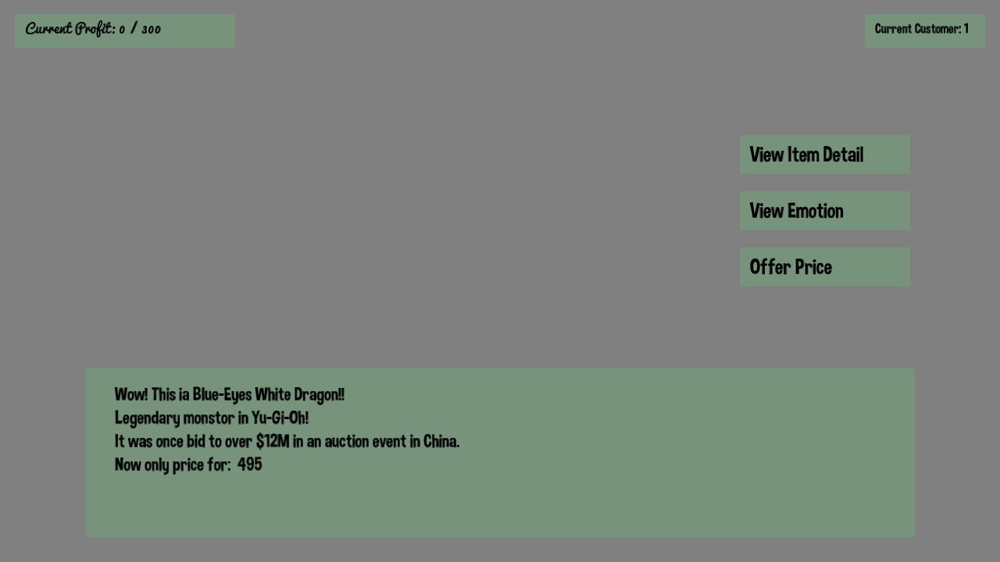

# Gamestop Simulator

Author: Zi Wang, Wenlin Mao, Tianrun(Martin) Ke

Design: You are working at gamestop where people would come and sell cards, gaming consoles or action figures to you. Be cautious though because some people are lying. You need to find out the true value of these items and make profit for your store!

Text Drawing: 

The text drawing pipeline is like this. The InitializeGlyaphMap will create all the 2d textures for all the ascii code from 32 to 127. And then, whenever we want to change text, SetText will regenerate the glyph position and info. Then in the DrawText, it will iterate through all the characters and calculate the positions, find the already saved texture_id and let opengl does the drawing.

Finite State Machine: 
This game is implemented using the Finite State Machine with all text rendering tasks defined as a state and
all player action defined as edges. Based on the state the player currently located,
different action will lead to different outcomes. The game is purely based on randomization,
thus the player is able to meet various condition and need to think how to overcome them.
The state will render text accordingly based on the randomized generated item type, item level, true price, NPC expect price,
and NPC bid price. Different combination will create different challenge for player to resolve.

Screen Shot:

How To Play:

Use mouse to click buttons to make decision. You can talk to 20 customers max. And your goal is to get $300 in profit.

Sources: 

Pipeline inspiration: https://github.com/GenBrg/MarryPrincess \
Dimbo font: https://www.dafont.com/dimbo.font?l[]=10&l[]=1 \
Pacifico font: https://fonts.google.com/specimen/Pacifico

Json loading: \
Stackoverflow: https://stackoverflow.com/a/39975809 \
nlohmann's JSON Repository on GitHub: https://github.com/nlohmann/json

This game was built with [NEST](NEST.md).

